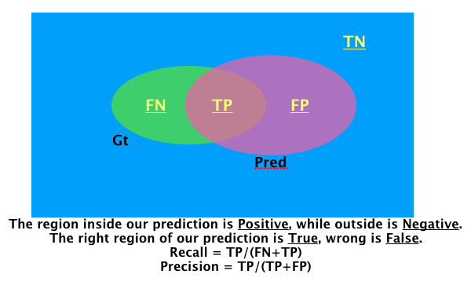
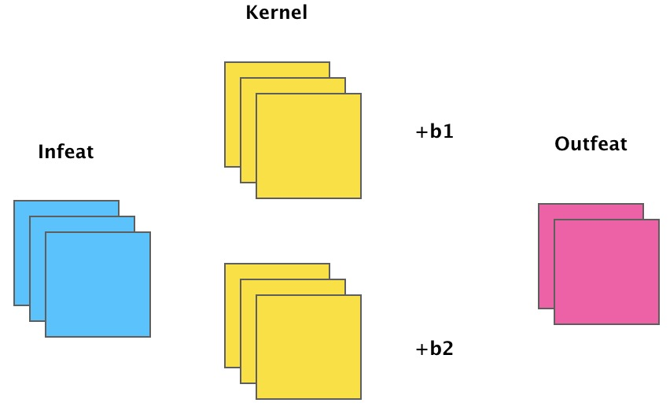

## Theory basis

- PCA is a linear transformation that can be easily learnt in one layer of the network

## Recall and Precision

## 一些琐碎但是非常重要的点

1. 在分割网络中，最后的输出卷积核如果是一层3x3的话，结果会很不稳定；比较好的办法是一层3x3，再接上一个1x1的卷积进行分类；

2. 面对没有padding的小网络的时候，应该在原图上加上一定量的padding，如果不加padding，原图上在边缘的ROI，在ROI feature对应位置会形成一个点或者一条线，这样会导致性能的下降(Discussed with LH at 2019-01-16)；

## FPN architecture

首先我们有一张图片，左边是一个普通的 ResNet 网络，其中的 stride 表示相对于原图分辨率降低了多少，例如 stride=2 代表相对于原图降低了2倍，stride=4相对于原图降低了 4 倍。然后右侧是从每一个 ResNet Block 的 ElementWise 加之后再经过 ReLU，进行 1x1 卷积得到的 feature map，即 M2～M5(Top-Down lateral modules)。之后我们就将M5的分辨率提升一倍加入到 M4 的特征中，依次类推，与此同时，我们利用 3x3 的卷积（因为特征相加之后会有噪声）去得到 P5～P2。这就是 FPN 的基本架构。
[__代码__](https://github.com/roytseng-tw/Detectron.pytorch/blob/master/lib/modeling/FPN.py)

## Learning Rate warming up

- **Constant warmup**: In constant warm up , you train the model with a small learning rate for few epochs(usually 5) and then increase the learning rate to “k times learning rate” .However this approach may cause a spike in the training error when the learning rate is changed.

- **Gradual warmup**: As the name suggests , you start with a small learning rate and then gradually increase it by a constant for each epoch till it reaches “k times learning rate”. This approach helps the model to perform better with huge batch sizee, which is in par with the training error of the model trained with smaller batches.

## BN derivation details

[BN detail](https://kevinzakka.github.io/2016/09/14/batch_normalization/)

## Misc details

- 标准的BN 是对channel算均值和方差，如图：

- 假如有了BN，那么之前的Conv不再需要Bias了

## 理解神经网络中通过add的方式融合特征

[https://www.zhihu.com/question/306213462/answer/562776112](https://www.zhihu.com/question/306213462/answer/562776112)

对于两路输入来说，如果是通道数相同且后面带卷积的话，add等价于concat之后对应通道共享同一个卷积核。因此add相当于加了一种prior，当两路输入可以具有“对应通道的特征图语义类似”（可能不太严谨）的性质的时候，可以用add来替代concat，这样更节省参数和计算量（concat是add的2倍）。

FPN[1]里的金字塔，是希望把分辨率最小但语义最强的特征图增加分辨率，从性质上是可以用add的。如果用concat，因为分辨率小的特征通道数更多，计算量是一笔不少的开销。CPN[2]为了进一步减少计算量，对于分辨率小的特征图在add前用1x1的卷积减少了通道数。又比如edge detection[3]的工作，里面不同层输出的edge map也通过weighted add融合在一起，这是因为这些输出的语义本来就是相同的，都用了label的loss来约束。还有一个例子是ResNet[4]的skip connection。这里的add主要是为了保持mapping的identity性质，使梯度回传得更加容易。同样的操作在LSTM[5]里的cell state也能看到。当然，如果不在乎计算量且数据足够的时候，用concat也是可以的，因为这两个本身就是包含关系。实际上concat在skip connection里用的也比add更普遍，比如题主提到的U-Net[6]、DenseNet[7]。

## semantic segmentation 本质上的难点？

[https://www.zhihu.com/question/285040907](https://www.zhihu.com/question/285040907)

A1(2018-12-25): 

1. 问题架构不好：缺乏整体观念。我们用whc这样一种表示来给每一个pixel分配一个label。如此以来，每一个pixel的prediction其实是割裂开的，没有显式的联系。（隐式的联系就是相邻像素的感受野重合程度大）。所以 现在CRF这样的后处理还是可以涨点。总的来说，目前的架构把分割当成一种dense prediction，没有像素之间聚合的整体观念。其实在local的部分，也没有local的观念...

2. 特征融合粗糙：局部精度还是达不到要求，目前高低层特征融合的方法还是有些粗糙。其实边界（比如毛发这种）还是没有哪片论文达到比较好的结果。由于不能要求标注精细到毛发都标出来，所以在现有基础上，尝试融合DL和一些low level的传统技巧也许也有用。

3. 语义分割本身就是一个退而求其次的课题，但panotique segmentation还没有一个比较好的解决方案，或者说instance segmentation现在都没有好的方案。 mask rcnn那种基于bounding box的方法上限被目标检测限制了，肯定不是好方法。也出现了一些no proposal的方法，但还是不够好。

4. 弱监督，标注太麻烦。最终还是需要引入low level的算法从图像本身挖掘监督信息。今年顶会出来好多，但是准确率其实都非常感人。

A2(2018-12-10):

1. 对新手来说，很容易在分析语意分割问题的时候把落脚点定在提升boundary的质量上（对说的就是我这个菜鸡）。然而语意分割使用的评价指标dataset-mIoU（比如voc就用了它，另外好像还有image-mIoU，但不知道哪个数据集用了）并不是那么care一两个像素点宽度的线，相反，由于标注歧义或是其他原因导致的大面积分类错误，我认为这种hard case才是提升性能的关键。

2. 另外的回答都提到了耗卡，但我觉得这些都不是问题的瓶颈，而是研究的瓶颈。什么分割结果太粗糙，减少output stride加decoder啊。骨架网络性能不够，automl啊。这就好比研究算法的，可以利用额外的空间复杂度来减少算法时间复杂度，那就都不是事。真正困难的是在当前最好时间复杂度算法上再去减少时间复杂度。

3. 现在很多人认为语意分割是比检测更难的任务，但是传统观点认为分割是中层的视觉任务，因为又要分类所以还是要结合高层语意信息。回想那些传统的图割算法，似乎都是无监督算法，而现在语意分割做的完全就是感受野下图像patch的分类问题。如何回归到无监督算法并有效结合深层语意信息，还要优雅地嵌入端到端网络，这个过程肯定很不优雅。目前较好的MSCI已经使用了传统算法得到的超像素区域进行特征融合，也许未来也会有更多类似工作吧。

## 关于做研究

大二就中 CVPR/ICCV/ECCV/NIPS 是一种怎样的体验？

A1(2018-04-04):

[https://www.zhihu.com/question/271293179/answer/360192576](https://www.zhihu.com/question/271293179/answer/360192576)

我的组里有大二中了ICCV的，不过是二作。一作的话，有两个大二学生差一点中了。要中一作顶会，一般需要一年的训练期（当然还有运气）。因为大一课多，学生一般都是大二上加到我们组的，所以一般在大三上出文章（我们组今年有3位大三同学中了CVPR 2018一作）。这主要是训练周期和课程时间点的问题，导致大二first author比较少（co-author是很多）。好像清华经常大一就加组了，估计会有不少大二就发顶会一作的。

我感觉一年的周期大概是这样的，掌握基本的代码和学会阅读文章需要3-4个月（对于基础扎实的学生），形成一个问题靠谱的技术路线和论文雏形需要3-4个月，最后，把结果做出来和论文写出来要3-4个月。但是，我和很多导师都有同一个感觉，**就是对于很多本科生即使发表了一作顶会并不意味着研究能力就很强了，主要体现在idea，方向感，学科格局理解等研究的核心要素还是不行。** 这也就需要在博士阶段继续的锤炼。另外，不要把大几就发顶会，这件事情看得太重，这对成为一个excellent researcher没什么必然联系，至少在我的组里不强调这个。虽然这种声音（或者噪声）会很影响本科生的情绪或者产生焦虑。但是还是希望我的学生能内心平静，enjoy research。宁静以致远吧。

