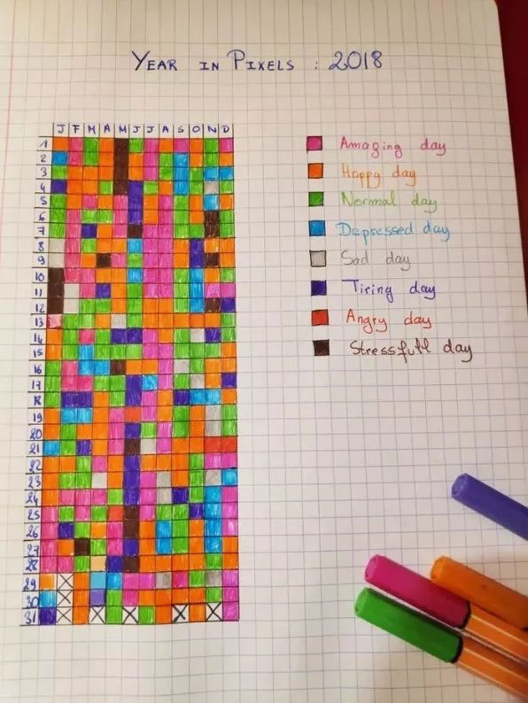
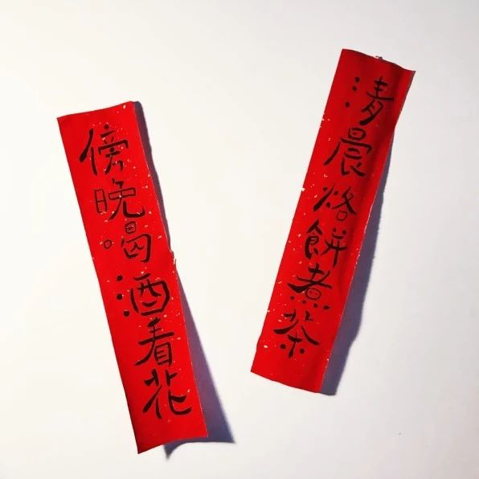

<pre>

Week 1

可是醒来的我知道，没了啊，我们没有以后了。人真的很奇怪，很多回忆里的片段和人总是悄悄进入梦里，可是睁开眼后比任何人都清醒，结局早就发生了。一转眼也好几年了，世界都变了，回忆却还安安生生的静默着，等你午夜梦回里来重温。
@萧覃含 at 2019-01-06

这一刻的风，气味，和天色像极了十几年前某个傍晚的复刻版，冲击天灵盖的相似度，好似转过街角就能撞进那个时空。
@垂耳水怪 at 2019-01-06

「你家房子虽然是按平方买的，但是你一定要按立方来用，都是血汗钱呐」某年看小组帖子看到的写的真好。
@贾姬 at 2019-01-06

输入法如果做年度总结：去年你打了三十多万个哈，可是感觉你又没有那么开心。
@Marskay at 2019-01-06

「古代人挺乐观的其实，有点闲工夫都琢磨着怎么长生不老，现代人忙完一天的事静下心来瘫在床上心里只有四个字：不想活了」
@pipiking at 2019-01-06

小市民聚在一起，最喜欢谈论的是两件事，一是别人的不幸，还啧啧地叹息着，以表示自己的善良，另一是别人的走运，还指指戳戳地评论着，以表示自己的正直。他们之热衷于“同情”他人的痛苦，与他们之热衷于嫉妒他人的幸福，其实是同一份德性的两种表现。
@光华kwanghua at 2019-01-06

Week 2

如果要选互联网行业年度照片，我会推荐这张。
@王兴 at 2019-01-13
 

要我牺牲睡眠去向人倾诉来缓解情绪不太可能了，现在睡眠才是我最好的情绪消化系统。
@惡二爺 at 2019-01-13

即使是一片树叶，放在不同的地方，也会有千万种风韵
@形散神更散 at 2019-01-13
 

刚看到有人说到朋友得抑郁症自杀了。真是难过。希望大家都好，像草，像水牛，像狼，像虎豹，像什么都好，在自己所属的地方，自在顽强地活着。
@huniubaby at 2019-01-13

小时候对苦难充满向往，以为它们会让我与众不同。现在我发现，苦难不能让我与众不同，却会把我变得更为雷同，变得和世界上所有的不幸一样，都长着一样的脸。
@沈倾欢 at 2019-01-13

圆月冻得又薄又亮，像落了一层白霜的桂花糖，满天星子碎银似地眨着光，我们穿行在雾气渐浓的密林里，偶尔一抬头，就能看见星月随行，空气里混合松枝，水杉和野草的清香，此情此景悦乐如此，正好应节。
@弥川 at 2019-01-13

@无聊图4号机 at 2019-01-13
 

Week 3

无论怎么被爱，人心里最容易惦记的还是没有被爱的回忆啊。
@Styx. at 2019-01-20

跟一家餐厅的老板娘聊。她们原来卖 8 折卡，储值一定金额即享 8 折，很难卖。因为即期大额支出，远期小额获益，用户很难接受。现在她们改变话术，充值本次消费额 4 倍金额，本次餐免费。其实质也是 8 折卡，但好卖太多。因为即期大幅受益，远期就不重要了。人就是不喜欢延期满足。
@钢板樱桃 at 2019-01-20

今天听到的：「固执不是一个人格或者性格问题，本质上是一个智力问题，是智商上的缺陷。」
@罗斯 at 2019-01-20

劳动者越是能得到合理回报，劳动积极性就越高，经济才能越快发展，反之亦然。在前者条件下，劳动光荣是成立的，在后者条件下，则是对最广大劳动人民的漠然和鄙视。
@OwlofMinerva at 2019-01-20

「走出舒适圈」是因为舒适圈不牢靠。真有铁打的舒适圈，我要往外迈腿我是茄子。
@东东枪 at 2019-01-20

人和人之间的交流永永远远充满着误解。我表达的是百分之七十，你能听出的是百分之四十，然后双方一直揪着那百分之三十不放，争论到最后已经和我的原意无关，慢慢又演变成了态度不对。一次毫无意义的交流就这么开始并且结束。这种交流每天都在我们的生活里上演。
@一只白 at 2019-01-20

生命要有绝对参照物，不能是钱。有些普通人的独特魅力就在于，房价涨涨跌跌，行业起起落落，但有些人心里有个理想和价值观大旗不倒，他们就可以淡定从容，安心做自己的事。风起雨落，我们都被时代和光环卷着走，但有人就是定海神针，拥有自己真正想做的事情，才是落地生根的第一步。
@Marskay at 2019-01-20

Week 4

往日火红的新年现在褪了颜色，它变得暗淡了、普通了、平常了，年味淡的如饮水，只解渴，没什么味。
@霆\_库里 at 2019-01-27

有些人表面上谈过很多次恋爱，但其实没有一次被好好爱过
@上海地我话事 at 2019-01-27

「新年启动，寻求答案的早晨来了。像水汽袅袅升腾，眼睛醒了。眺望着高高升起在空中的梦，好似气球一样。」
@鹤景 at 2019-01-27

戴眼镜的人，用镜片把自己挡了起来，和热带鱼时间也隔着一层玻璃。鱼缸偶尔是圆的，平时都是方的。在这个规规矩矩的世界，道德是一件透明的事情。
@夏废 at 2019-01-27

圆月冻得又薄又亮，像落了一层白霜的桂花糖，满天星子碎银似地眨着光，我们穿行在雾气渐浓的密林里，偶尔一抬头，就能看见星月随行，空气里混合松枝，水杉和野草的清香，此情此景悦乐如此，正好应节。
@弥川 at 2019-01-27

这可能就是有暖气的北方吧
@虾爬子君 at 2019-01-27
[image:5022970A-77B9-4FB4-A195-FDA09598FA23-1251-000191AA1EA6214F/931A658F-9DEA-485B-861E-6BA6EF654EF7.png]

以后谁再问我，你不是经常去健身吗怎么还这么胖？
我就回她，你不是经常去上班吗怎么还这么穷。
@中东石油大亨 at 2019-01-27

熟人不敢下手，生人不敢开口。没有了一见钟情的资本。少了日久生情的条件。人群中是个段子手，人群后是个单身狗。
@查理·布朗 at 2019-01-27

喜欢的人会在不知不觉中影响你在聊天中使用的表情，不单说表情包，哪怕只是微信里默认的那些表情。
@Marskay. at 2019-01-27

「等你再长大一点，等你再经过一段人生，你就会发现，一个艺术家的价值与一个餐馆老板的价值并没有多大的分别。艺术家在卖画的时候，他也只是个商人而已。人的清高与否，不在于他的职业，而在于他的思想和情操。」
@慕清欢 at 2019-01-27

跟西班牙人学来的：家里有两个孩子分零食点心的时候，大人最好不要干预，也不要强行规定谁必须要让着谁。让小朋友自己分，只有一个要求：一个人负责分好/切好，另外一个人先选。时间长了，负责切/分东西的孩子会练就一身精准无比的手法儿
@醋溜小肉段儿 at 2019-01-27

「现代社交礼仪、乐器及乐理、轻武器射击、机动车驾驶、中英文写作、数学及编程」——看见有人这么解释“六艺”。礼乐射御书数。很有点意思。
@东东枪 at 2019-01-27

我把夜熬成粥
喂食眼睛里的两条血龙
我把大风织成线
豢养游荡在执念里的野鬼
我把篝火扑灭
祭奠扑火的痴情蛾魂
我把楼兰救起
向人性的的贪婪宣战
我把你放在心上
压抑着向全世界炫耀的幼稚
@诗馆念酒辞 at 2019-01-27

优越感和自信心若建立在他人评价上必然不稳定，且易受人操控。成年人应活出别人的评价，若有能力还应尽量做一个选择者而不是被选择者。评价和选择是两回事，别被话语愚弄了，叫好不叫座和叫座不叫好的都不罕见。
@gravity0 at 2019-01-27

Week 5

清晨烙饼煮茶 傍晚喝酒看花
@小宇妹妹 at 2019-02-03
 

看到很多自媒体“大V”一窝蜂地批斗咪蒙。这是得到上面的指示了？还是只是因为同行是冤家？千万别告诉我他们是因为自媒体的良心才批斗咪蒙的。无论是因为什么原因，唇亡齿寒这么简单的道理搞不清楚吗？
@饭友经典语录 at 2019-02-03

你觉得自己除却巫山不是云，不过是被过往的幻想和伤痛蒙蔽了眼睛，让你失去了知与觉的能力。
@琦殿 at 2019-02-03

今早来婆婆家问买了春联没有，婆婆说街道发都懒得去领。我二话不说吃完早饭穿衣服下楼先逛超市补买食材，然后超市门口买春联福字，回来以后张罗老公贴上。活了三十年的最大经验是，不要试图改变别人的习惯，独善其身，有什么想法靠自己的本事去落实，等自己能发光了自然会照耀别人。
@某小朵 at 2019-02-03

「如果有一天你结婚了，希望对方是一个让你心动的人，而不是权衡利弊之后觉得不错的人。」
@篱笆上的星星 at 2019-02-03

「不要去羡慕那些每天在你朋友圈里晒货晒幸福唧歪个没完的人，作为话题的消费品，他们是无足轻重的。真正了不起的人都在你所不知道的线下隐蔽的成长着。」
@野田酱 at 2019-02-03

哈哈哈：过年了，上海写字楼里的 Linda、Vivian、Angel、George、Michael、David 陆陆续续回到老家，名字变成了桂芳、翠花、秀兰、大强、红军、狗蛋；而北京各大部委格子间里的小李、小张、小王、小赵、小于挤上火车，陆陆续续回到家乡，名字都变成了李处、张处、王处、赵处。
@徒有实名 at 2019-02-03

别总指责老年人不思改变不学习新鲜事物了，别说老年人了，我才三十几岁，超市新开的自助结账通道我都懒的去研究，宁愿在人工通道排队。
@小怪兽为什么这么忧伤 at 2019-02-03

即使目前经济效益最好的京沪高铁，资产利润率也不到5%，与银行的基准利率相差无几。除了京沪、京广通道上的高铁运输能力得到较高利用外，其他高铁项目的运能大量闲置，存在严重亏损。例如，连接兰州与乌鲁木齐的兰新高铁，每天只开行四对高铁列车，其运输收入甚至不足以支付电费。
@抱阳 at 2019-02-03

Week 6

突然很怀念小时候的春节，有震耳欲聋的鞭炮声，有无数可以假设的未来。现如今，每一次过年都像无奈的对望，无论是我们还是父母、亲友，大家都抓不住什么。有时候想，人生如梦，只是我们的梦交织在一起了，或许另一个世界，有另外的你我。
@viviyo at 2019-02-10

绝大部分人都是普通人。结婚后童话般的幸福和普通人没关系，不结婚也跟哲人的高贵孤独沾不上边。结婚就是找一个平庸的伴侣过平庸的日子，不结婚就是一个人平庸的孤独着。倒是有很多人脑子不太清醒，以为平庸的自己可以靠不结婚变得不平庸，或者平庸的自己可以靠等一个不平庸的人来跟自己结婚。
@葡萄好甜 at 2019-02-10

如果我们和媒体一样，随时都在讨论票房、市值、工资、房价，那么价值观就会永远扭曲下去。自己活得糊涂不说，还把后代也带歪了。我们似乎更希望做个机器，关心各种外界的数据，而唯独不关心内心的安宁和富足。
@乐鼠老人 at 2019-02-10

人是会变的，但是不会改。
@不破萬作 at 2019-02-10

我在很多城市不同国家陆续生活着，还没有工作却已经搬过很多次家住过各种各样的房子，有冬天里阴暗潮湿只有一张铁床和漏风玻璃窗的小黑屋，也有宽大明亮整洁温馨的房间。每个地方都承载了不同时期的我，十几年的不断颠簸，这大概也是我容易累的原因，在有些方面我已经没有野心了。
@渊辞 at 2019-02-10

正确的自有道理。错误的令人着迷。
@东东枪 at 2019-02-10

Week 7

「人活在世界上，快乐和痛苦本就分不清，所以我只求它货真价实。-王小波」
@无聊图4号机 at 2019-02-17
 

返工第一天，见到喜气洋洋的同事们，回到亲切熟悉的工位，心里只有一个感受 — 还是放假好。
@东东枪 at 2019-02-17

常用发脾气来保护自己的人，终将听不到自己以外的声音，被放逐到回声的世界。
@gravity0 at 2019-02-17

年轻的时候什么都想要，分不清什么是芝麻什么是西瓜，觉得未来可期，打赌自己一定会是那个幸运的人，天真盲目自以为是。而过了几年后发现，那些少年时以为的喜欢其实也只是喜欢而已，而爱根本不是想象中那么容易和美好。开始能分得清喜欢和爱的差别，喜欢很热烈，而爱因为平凡反而太难。
@渊辞 at 2019-02-17

不需要问爱情是什么，也不必探究爱情的意义，当你觉得那是爱情，那就是了，也许美好甜蜜快乐充满希望，也许卑微怯懦痛苦伤心，都不妨碍爱情的发生和进行，人生一场，重在参与，好好爱吧。
@7姑娘 at 2019-02-17

听闻了亲戚们的许多事，纠葛重重，过于跌宕，有些人的人生几乎是急转直下。但见不到真人，总不太想描摹。想象和转述都觉得空泛。
@梁京 at 2019-02-17

给任务排序并取舍，是高效的秘诀，也是被低估的一项能力。
@饭而不否 at 2019-02-17

明朝的皇帝姓朱，为了避讳，明朝的猪不叫猪，叫肥肥。清朝才又改回来。#冷知识#
@怡红快绿 at 2019-02-17

Week 8

不要跟心理年龄老的人谈恋爱，老人心里都是账本，他们衡量大部分事情的标尺都是“值不值得”。怪没意思的。
@米小柒eva at 2019-02-24

“今晚月色真美”=“我喜欢你”，答应就回答“风也温柔”，拒绝就回答“适合刺猹”。
@Menagerie at 2019-02-24

那些欲擒故纵的把戏谁不知道呢，只是忍不住，你发消息过来忍不住缓一缓再回复，你评论我也忍不住不应答。那些让你忽上忽下的刺激我统统无法给予。所有平静的醇厚的状态都是被低估了的爱。
@干杯呗 at 2019-02-24

「所有年轻人最终会迎来属于他们的告别时刻。他们会留下黑暗中的影子。而太阳会升起来，他们会继续醉酒、会继续做梦、会继续奔向永恒的遗忘。 而更年轻的人会继续长大，会在时间的废墟里认出诅咒般的祝福。」
@NeverTilt at 2019-02-24

Week 9

据说孩子来到这个世界，总有一段时间会疯狂测试自己的边界和周围人的底线，摸到线也就消停了，以后知道有条线在那儿。若一直得不到反馈，或无法理解记不住，则一直作死下去，这是生物拓展生存空间的本能。
@gravity0 at 2019-03-04

遗忘是个终极解决方案。粗暴且有效。其粗暴令人无奈，其有效值得感激。
@东东枪 at 2019-03-04

很多人谈恋爱的初衷是「空虚孤独的时候有人陪伴」，却没有料到代价是「正常的社交和娱乐全都被占满，all turns to be有人陪伴着的空虚孤独」。#抄台词#
@Marskay at 2019-03-04

我有时很晚才睡 那是我躲藏的地方
@25岁 at 2019-03-04

为什么说谈恋爱/相亲/认识新人的过程很累，在由浅入深的交往过程中，开始的百分之八十的交流都是无效沟通，没办法达到深层的交流。两个人就生活工作和娱乐模式做意见交换而已，双方不敢轻易谈论三观和历史。很多时候我们抵触认识新人是时间成本很大程度上最终都打了水漂。
@干杯呗 at 2019-03-04

「我喜欢城市，喜欢萦绕着烟火气和雾色的街，我喜欢恋人们走过的广场，喜欢图书馆，地铁站，公园门口打着伞的姑娘，喜欢在喧哗的人群中孤身一人的感觉。也许我是个俗气透顶的人，但我觉得城市是最浪漫的地方，远胜孤寒的高原，杳无人烟的旷野，远胜那些所谓的远方，远胜那些被文字粉饰的粗鲁和狂野。」
@呼吸真麻烦 at 2019-03-04

真的「极度渴望成功」的人其实并不多，符合后半句「愿付非凡代价」的就更少了。
@王兴 at 2019-03-04

</pre>

